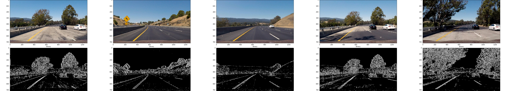

## Advanced Lane Finding Project
[](http://www.udacity.com/drive)

Finding lane lines in a video from camera mounted on a car for Udacity Self-Driving Car Nanodegree program. Here is how the end result looks like. The area inside the lanes are highlighted in green, and the lane detection is applied to a test video.

[](http://www.youtube.com/watch?v=bdHtsbaUso8 "Finding Lane Lines for Autonomous Driving")

## Table of Contents
* [The Project](#the-project)
* [What's in this repo](#what's-in-this-repo)
* [Camera calibration](#camera-calibration)
* [Pipeline (single images)](#pipeline-(single-images))
* [Pipeline (video)](#pipeline-(video))
* [Discussion](#discussion) 

## The Project

The goals/steps of this project were the following:

* Compute the camera calibration matrix and distortion coefficients given a set of chessboard images.
* Apply a distortion correction to raw images.
* Use color transforms, gradients, etc., to create a thresholded binary image.
* Apply a perspective transform to rectify binary image ("birds-eye view").
* Detect lane pixels and fit to find the lane boundary.
* Determine the curvature of the lane and vehicle position with respect to center.
* Warp the detected lane boundaries back onto the original image.
* Output visual display of the lane boundaries and numerical estimation of lane curvature and vehicle position.

This README is structured around the [Rubric](https://review.udacity.com/#!/rubrics/571/view) points for the project.

## What's in this Repo

```
├── example.ipynb: Main notebook for exploration and showcasing
├── data: contains calibration images, example images and videos
├── output: result of processing
├── scripts: helper scripts for running/testing code snippets
└── src: all the code is here
```

Additionally, there is [environments.yml](environment.yml) file which can be used to set up
local environment to run the notebook and other scripts. For more details, refer to [this repo from
Udacity](https://github.com/udacity/CarND-Term1-Starter-Kit.git).

```bash
conda env create -f environment.yml
```


<a name="camera-calibration"></a>
### Camera Calibration

The code for camera calibration can be found in the `calibrate` function inside [src/calibration.py](src/calibration.py) 
file. Calibration can be performed as follows. The same lines of code are also used in the example IPython notebook [exploration.ipynb](exploration.ipynb).

```python
from src import calibration
camera = calibration.Camera()
camera.calibrate()
camera.undistort(img)
```

Calibration starts with preparation of "object points", which are the (x, y, z) coordinates of the chessboard corners 
in the real world. We can assume that the chessboard is fixed on the (x, y) plane at z=0, such that the object points 
are the same for each calibration image.  Thus, `objp` is just a replicated array of coordinates, and `objpoints` are 
appended with a copy of it every time all chessboard corners are detected in a test image. Similarly, `imgpoints` are
appended with the (x, y) pixel position of each of the corners in the image plane with each successful chessboard 
detection.  

The lists of `objpoints` and `imgpoints` are used to compute the camera calibration and distortion coefficients using
`cv2.calibrateCamera` function from OpenCV. Then, distortion correction can be applied to any image using 
`cv2.undistort` function. Here is an example of how distortion correction is applied to one of the chess board images.
 


Notice how the top central boxes in the chess board appear to have been slightly "straightened" after this
distortion correction.


### Pipeline (single images)

These are the steps taken to find lane markings in a single image. The same function is invoked for processing individual frames from the videos later. The pipeline can be found in `detect` function inside `LaneDetector` class in `src/lane_detection.py`.


#### 1. Thresholding to Create Binary Images

A combination of color and gradient thresholds to generate a binary image (in `threshold` function in [Thresholder class in thresholding module](src/thresholding.py)). What worked best in the test video was thresholding based on absolute values and applying Sobel filter on S channel from the [HLS colorspace](https://en.wikipedia.org/wiki/HLS_color_space) and R channel from RGB color space. It turns out that the same thresholds did not work equally well for challenge video. The actual values of the thresholds for each video can be found in the [src/config.py](src/config.py) file.

Here is an example of my output for this step operated on some test images.



To see the effect of thresholding for individual images, please refer to [output/images/thresholding](output/images/thresholding) folder. The originals and binary images have the corresponding identifiers in their file names.

The code which performs thresholding on the test image looks like this inside the `detect` function. Notice that we instantiate `Thresholder` class to encapsulate thresholding logic.

```python
im_thresholded = self._thresholder.threshold(img)
```


#### 2. Distortion Correction

The matrices derived from camera calibration is stored in `Camera` object from `src/calibration.py`. The matrices derived from calibration step are used to apply distortion correction using `undistort` function from `Camera` class. The `undistort` function calls `cv2.undistort` for performing the distortion correction.

Below is an example of distortion correction applied to a test image.


#### 3. Perspective Transform

Source points

For simplicity, the `Camera` class exposes `warp_image` function, which internally performs the distortion correction. Distortion correction is applied by the following lines in the `detect` function in `LaneDetector`.  

```python
im_warped = self._camera.warp_image(im_thresholded.astype(np.float), self._perspective_transform_mat)
```

Here is the result of perspective transformation applied a test image.


The code for my perspective transform includes a function called `warper()`, which appears in lines 1 through 8 in the file `example.py` (output_images/examples/example.py) (or, for example, in the 3rd code cell of the IPython notebook).  The `warper()` function takes as inputs an image (`img`), as well as source (`src`) and destination (`dst`) points.  I chose the hardcode the source and destination points in the following manner:

```python
```

This resulted in the following source and destination points:

| Source        | Destination   | 
|:-------------:|:-------------:| 
| 585, 460      | 320, 0        | 
| 203, 720      | 320, 720      |
| 1127, 720     | 960, 720      |
| 695, 460      | 960, 0        |

I verified that my perspective transform was working as expected by drawing the `src` and `dst` points onto a test image and its warped counterpart to verify that the lines appear parallel in the warped image.

![alt text][image4]

#### 4. Describe how (and identify where in your code) you identified lane-line pixels and fit their positions with a polynomial?

Then I did some other stuff and fit my lane lines with a 2nd order polynomial kinda like this:

![alt text][image5]

#### 5. Describe how (and identify where in your code) you calculated the radius of curvature of the lane and the position of the vehicle with respect to center.

I did this in lines # through # in my code in `my_other_file.py`

#### 6. Provide an example image of your result plotted back down onto the road such that the lane area is identified clearly.

I implemented this step in lines # through # in my code in `yet_another_file.py` in the function `map_lane()`.  Here is an example of my result on a test image:

![alt text][image6]

---

### Pipeline (video)

#### 1. Provide a link to your final video output.  Your pipeline should perform reasonably well on the entire project video (wobbly lines are ok but no catastrophic failures that would cause the car to drive off the road!).

TODO: add comment about how I debugged. Comment about thresholding.

Here's a [link to my video result](./project_video.mp4)

---

### Discussion

Here is a brief discussion about the approach I took, what techniques I used, what worked and why, where the pipeline 
might fail and how I might improve it if I were going to pursue this project further.

* Speed - Slow (4 frames per second, but this could be higher)
* Take into account the curvature of the lane lines in relation to one another and compared with the previously aggregated values to find
  out confidence. We are using curvature calculation to disregard outliers. Similarly, we could probably also integrate 
  the offset information. All of these could be used to compute a adaptive score, much better than mere
  average or median to detect outliers. In the harder challenge, the lanes are almost 
                                          horizontal in some frames even after perspective transform.
* Due to the use of median filter, the response to lane curvature changes is slightly delayed. This has an impact
 on the performance of the detector on the harder challenge video because the changes are quite big. 
* The same thresholding values as that for challenge_video worked for the harder challenge to get the lanes in
warped binary image, but due to changing lighting conditions, the image is very noisy. Maybe, we could use a notion of
"noise level" in an image into the lane detection pipeline so that we could disregard best fit lines which might
succesfully fit a best fit line, but the line might be capturing some other artifact. We could extend this concept a bit further
to **adapting the thresholds** in the image based on the "noise level".
 
