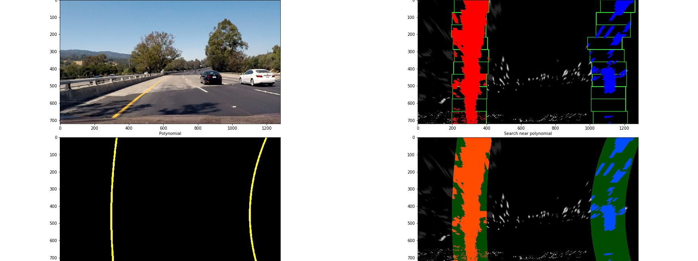

## Advanced Lane Finding Project
[](http://www.udacity.com/drive)

Finding lane lines in a video from camera mounted on a car for Udacity Self-Driving Car Nanodegree program. Here is how the end result looks like. The area inside the lanes are highlighted in green, and the lane detection is applied to a test video.

[](http://www.youtube.com/watch?v=bdHtsbaUso8 "Finding Lane Lines for Autonomous Driving")

## Table of Contents
* [The Project](#the-project)
* [What's in this repo](#what's-in-this-repo)
* [Camera calibration](#camera-calibration)
* [Pipeline (single images)](#pipeline-(single-images))
* [Pipeline (video)](#pipeline-(video))
* [Discussion](#discussion) 

## The Project

The goals/steps of this project were the following:

* Compute the camera calibration matrix and distortion coefficients given a set of chessboard images.
* Apply a distortion correction to raw images.
* Use color transforms, gradients, etc., to create a thresholded binary image.
* Apply a perspective transform to rectify binary image ("birds-eye view").
* Detect lane pixels and fit to find the lane boundary.
* Determine the curvature of the lane and vehicle position with respect to center.
* Warp the detected lane boundaries back onto the original image.
* Output visual display of the lane boundaries and numerical estimation of lane curvature and vehicle position.

This README is structured around the [Rubric](https://review.udacity.com/#!/rubrics/571/view) points for the project.

## What's in this Repo

```
├── example.ipynb: Main notebook for exploration and showcasing
├── data: contains calibration images, example images and videos
├── output: result of processing
├── scripts: helper scripts for running/testing code snippets
└── src: all the code is here
```

Additionally, there is [environments.yml](environment.yml) file which can be used to set up
local environment to run the notebook and other scripts. For more details, refer to [this repo from
Udacity](https://github.com/udacity/CarND-Term1-Starter-Kit.git).

```bash
conda env create -f environment.yml
```


<a name="camera-calibration"></a>
### Camera Calibration

The code for camera calibration can be found in the `calibrate` function inside [src/calibration.py](src/calibration.py) 
file. Calibration can be performed as follows. The same lines of code are also used in the example IPython notebook [exploration.ipynb](exploration.ipynb).

```python
from src import calibration
camera = calibration.Camera()
camera.calibrate()
camera.undistort(img)
```

Calibration starts with preparation of "object points", which are the (x, y, z) coordinates of the chessboard corners 
in the real world. We can assume that the chessboard is fixed on the (x, y) plane at z=0, such that the object points 
are the same for each calibration image.  Thus, `objp` is just a replicated array of coordinates, and `objpoints` are 
appended with a copy of it every time all chessboard corners are detected in a test image. Similarly, `imgpoints` are
appended with the (x, y) pixel position of each of the corners in the image plane with each successful chessboard 
detection.  

The lists of `objpoints` and `imgpoints` are used to compute the camera calibration and distortion coefficients using
`cv2.calibrateCamera` function from OpenCV. Then, distortion correction can be applied to any image using 
`cv2.undistort` function. Here is an example of how distortion correction is applied to one of the chess board images.
 


Notice how the top central boxes in the chess board appear to have been slightly "straightened" after this
distortion correction.


### Pipeline (single images)

These are the steps taken to find lane markings in a single image. The same function is invoked for processing individual frames from the videos later. The pipeline can be found in `map_lanes` function inside `LaneDetector` class in `src/lane_detection.py`.


#### 1. Thresholding to Create Binary Images

A combination of color and gradient thresholds to generate a binary image (in `threshold` function in [Thresholder class in thresholding module](src/thresholding.py)). What worked best in the test video was thresholding based on absolute values and applying Sobel filter on S channel from the [HLS colorspace](https://en.wikipedia.org/wiki/HLS_color_space) and R channel from RGB color space. It turns out that the same thresholds did not work equally well for challenge video. The actual values of the thresholds for each video can be found in the [src/config.py](src/config.py) file.

Here is an example of my output for this step operated on some test images.


To see the effect of thresholding for individual images, please refer to [output/images/thresholding](output/images/thresholding) folder. The originals and binary images have the corresponding identifiers in their file names.

The code which performs thresholding on the test image looks like this inside the `map_lanes` function. Notice that we instantiate `Thresholder` class to encapsulate thresholding logic.

```python
im_thresholded = self._thresholder.threshold(img)
```


#### 2. Distortion Correction

The matrices derived from camera calibration is stored in `Camera` object from `src/calibration.py`. The matrices derived from calibration step are used to apply distortion correction using `undistort` function from `Camera` class. The `undistort` function calls `cv2.undistort` for performing the distortion correction.

Below is an example of distortion correction applied to a test image.


#### 3. Perspective Transform

One of the example images were used to mark source and destination points for the perspective transformation. Coordinates of the pixels on the lanes were used as *source* and *200 px* inside the width of the image were used as destination using `rectangle_pts_inside_image` in `src/utils.py`.

This resulted in the following source and destination points:

| Source        | Destination   | 
|:-------------:|:-------------:| 
| (242,691)      | (250, 720)   | 
| (1058, 691)    | (1030, 720)  |
| (706, 464)     | (1030, 0)    |
| (576, 464)     | (250, 0)     |


The points are overlaid on the example image and the unwarped image below.


I verified that my perspective transform was working as expected by drawing the `src` and `dst` points onto a test image and its warped counterpart to verify that the lines appear parallel in the warped image.

For simplicity, the `Camera` class exposes `warp_image` function, which internally performs the distortion correction. Distortion correction is applied by the following lines in the `map_lanes` function in `LaneDetector`.  

```python
im_warped = self._camera.warp_image(im_thresholded.astype(np.float), self._perspective_transform_mat)
```

Here is the result of perspective transformation and thresholding applied on a test image.


#### 4. Identifying lane pixels and Fitting Polynomial

After thresholding and applying perspective transformation on the image, histogram was calculated by summing up all the non-zero pixels across X-direction in the image. This gives the x-coordinate where the lane lines could be. 

The pixels in a sliding window, configured via `src/config.py` were considered for further calculation. The height of the window was calculated based on the number of windows to use along the height of an image, also configured via `config.py`. For the test images, the values were `100px` and `10` respectively. Only the coordinates of the bottom-most sliding window is derived from the histogram. For the next window above the bottom-most one, the number of non-zero pixels is counted. If the number of pixels found in the window is greater than a certain threshold (`minpix` in `config.py`), the next window was centered at the center of all the detected points. The code for the sliding window can be found in `_find_lane_px_using_sliding_windows` method in `LaneDetector` class in `src/lane_detection.py`.   

The pixels are used together with `np.polyfit` method to find the best fitting second order polynomial. Detected lane pixels are stored using `update` method in `Lane` class found in `src/lane_detection.py`.

For subsequent images, instead of using sliding window, the region around the polynomial is used for detecting lane pixels within a given margin (in `_find_lane_px_using_poly` method in `LaneDetector` class in `src/lane_detection.py`). This is particularly important for detecting lanes in subsequent frames in a video.

The `find_lane_pixels` method of `LaneDetector` uses polynomial based or sliding-window based search depending on whether a best-fit polynomial was detected in earlier frame. For the test images, only sliding-window method is used, because there is no notion of "subsequent frames" for them. 

```python
left_x, left_y, right_x, right_y, im_search_window = self.find_lane_pixels(im_warped)
```

The effect of the aforementioned steps on an example image are shown below. The left lane pixels are colored red, the right lane pixels are colored blue, and the search region is shown in green.
 
 

#### 5. Radius of Curvature and Vehicle Offset

Once the pixels from lane lines were found using sliding window or polynomial search, these points were converted into meters using a fixed ratio. Another polynomial was fitted on these points to derive the coefficients. Finally, the [radius of curvature](http://www.intmath.com/applications-differentiation/8-radius-curvature.php) for each lane lines were calculated by using these coefficients. 

The code for the curvature calculation can be found in `calculate_curvature` method in `Lane` class.

As for detecting the offset of the car from the center of the lanes, pixel coordinates of the lanes at the bottom of the image were computed. The distance from the center of the lanes to the center of the image was calculated. This distance was converted to meters using the same ratio as above. The code can be found in `calculate_offset` method in `LaneDetector`.    

#### 6. Mapping lanes

After the coefficients of the best-fit polynomial has been identified, pixel coordinates are generated on the line that lie exactly on the polynomial. A polygon is drawn on another image that is described by these points. This image is warped using inverse of the matrix used for the perspective transformation earlier. The resulting image is then combined with original image to show the area between the lanes. 

Here is an example image showing the lanes in an example image.


The following image shows the steps described above applied to example images.


---

### Pipeline (video)

#### 1. Final Video Output

Result of lane detection on the sample videos can be found in [output/videos](output/videos) folder. 

An example video has also been uploaded to [youtube](http://www.youtube.com/watch?v=bdHtsbaUso8).

---

### Discussion

Here is a brief discussion about the approach I took, what techniques I used, what worked and why, where the pipeline 
might fail and how I might improve it if I were going to pursue this project further.

Due to changing lighting condition changes, thresholding does not work completely robustly throughout the video. Due to this, the lane lines wobbled every now and then. I maintain a list of last 10 detected image frames in a FIFO queue. Outliers with outlandish radius of curvatures (not within 10m and 100km) are discarded. Also, if the current value is too different from the median (0.01 times or 10 times), then also the best-fit is discarded. For mapping the lanes onto an image and for curvature calculation, the median of the coefficients in the queue are used. Median filtering seems to make the detection much robust. 

Due to the median filter, the response to lane curvature changes is slightly delayed. This has an impact on the performance of the detector on the harder challenge video because the changes are quite big. An idea would be to use all the raw points in all of those images and weigh the error when finding the best-fitting line, with more recent frames weighed more. This could result in better performance especially on winding roads.

Also, the left and right lanes are currently evaluated completely independent of one another. We could take into account the curvature of the lane lines in relation to one another and compared with the previously aggregated values to find out confidence scores. 
  
Just like we are currently using curvature calculation to disregard outliers. Similarly, we could probably also integrate the offset information by factoring in the current steering angle. All of these could be used to compute a adaptive score, much better than mere average or median to detect outliers. In the harder challenge, the lanes are almost horizontal in some frames even after perspective transform.

The thresholding values from the challenge_video seem to be able to extract lane pixels for the harder challenge to get the lanes in
warped binary image, but due to changing lighting conditions, the image is very noisy. Maybe, we could use a notion of
"noise level" in an image into the lane detection pipeline so that we could disregard best fit lines which might
succesfully fit a best fit line, but the line might be capturing some other artifact. We could extend this concept a bit further
to **adapting the thresholds** in the image based on the "noise level".
 
